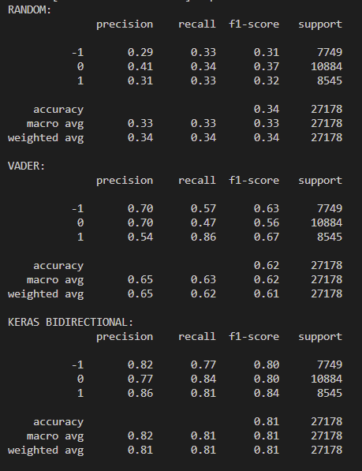

# SentimentAnalysisTool
Sentiment Analysis Tool Project for ECCS 4461 - Artificial Intelligence by Ryan Massie

Version: 1.0
Release 4/26/24

Natural Language Processing (NLP) is broken into these componants:
1.  Text Acquisition
2.  Tokenization
3.  Stopword Removal
4.  Normalization
5.  Stemming and Lemmatization
6.  Part-of-Speech Tagging (POS)
7.  Named Entity Recognition (NER)
8.  Parsing
9.  Word Embeddings
10. Text Classification/Clustering
11. Sentiment Analysis
12. Topic Modeling
13. Machine Translation

The goal of this project is to design a system to perform these key task using AI/Machine Learning databases.
Implemented Models Include:
    1. Random
    2. NTLK Vader Model
    3. Bi-Directional Deep Learning Model implemented using Keras & Tensorflow

Run SentimentAnalysisTool.py to execute Takes About 2 Hours (on my laptop) to build Keras model. Results can be viewed below.

